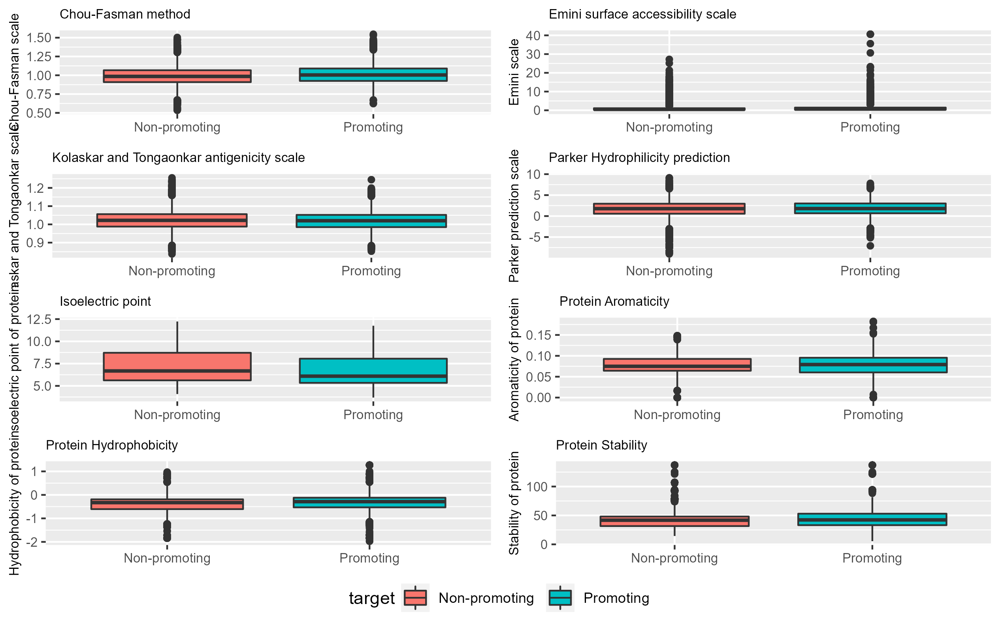
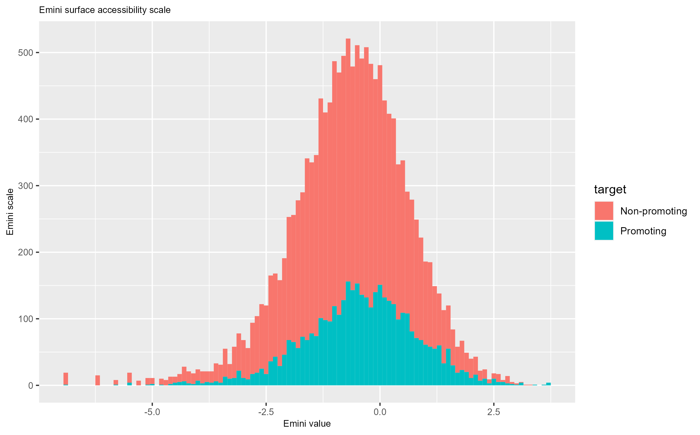

```{r setup, include=FALSE}
knitr::opts_chunk$set(echo=TRUE)
knitr::opts_chunk$set(warning=FALSE)
knitr::opts_chunk$set(fig.align="center")
library(RWeka)
library(pander)
library("RWeka")
library("data.table")
```

```{r load_data, include = FALSE}
bcel_sars_report <- read.arff("../Data/Weka/bcel_sars_log_transform.arff")
```
\newpage
# Abstract

The data used in this project was to determine if the properties of a peptide/protein are usable in determining if it promotes antibody binding to itself, as it could then be used to help dial in researchers on which protein/peptides to focus on in creation of vaccinations.


\newpage
# 1 Introduction

In modern day science, machine learning is playing a more crucial step by the year, allowing predictions of topics which would take years to discover with the help of experiments. However, a caveat to this is, that the prediction is only as good as the submitted data and the programmer who coded the algorythm for machine learning.

As such it is important for one to understand what one can do with the data they've received and that they know the background of the data itself. As such it is important to garner background information about the data and to explore what's possible with the received data by the help of an EDA.


It would be important to explore what the meaning and use for each data variable is before we start working with the data.

First off we'll discuss what the origin of the data files is, the [paper](https://www.biorxiv.org/content/10.1101/2020.07.27.224121v1)(https://www.biorxiv.org/content/10.1101/2020.07.27.224121v1) that this dataset was used in, references [IEDB](http://tools.iedb.org/bcell/help/)(http://tools.iedb.org/bcell/help/) as the main source for the peptide sequences, due to the website containing information about if an amino acid peptide exhibited antibody inducing activity, which was marked as the target label.
So both the bcel & sars peptide data have been sourced from IEDB, with the protein properties being filled in with help of the Uniprot website.
The covid peptide/protein data has been calculated with help of the same websites, except for that these haven't been labelled by IEDB.

So in the data-files the following columns are available and will be explained below:

1. parent_protein_id; This is the parent protein ID, with which it can be found on Uniprot. It's a string containing a protein ID.
2. protein_seq; This is the protein sequence of the full protein the peptide belongs to. It's a string that consists of amino acids.
3. start_position; This is the starting position of the peptide in correspondence to the full protein sequence given in protein_seq. It's an integer.
4. end_position; This is the ending position of the peptide in correspondence to the full protein sequence given in protein_seq. It's an integer.
5. peptide_seq; This is the peptide sequence that is to be analyzed. It's a string containing amino acids.
6. chou_fasman; This is a calculated peptide feature by the IEDB website, it predicts if there is a ß turn in the peptide. It's a double.
7. emini; This is a calculated peptide feature by the IEDB website, it calculates how much relative surface accessibility is available on the peptide. It's a double
8. kolaskar_tongaonkar; This is a calculated peptide prediction by the IEDB website in how antigenic the peptide is. It's a double.
9. parker; This is a calculated peptide feature by the IEDB website in how hydrophobic the peptide is. It's a double.
10. isoelectric_point; This is the calculated pH at which the charge of the protein is zero. It's a double.
11. aromacity; This is a calculated protein feature in how many aromatic connections there are in the protein. It's a double.
12. hydrophobicity; This is a calculated protein feature in how hydrophobic the complete protein is. It's a double.
13. stability; This is a calculated protein feature that refers to the energy difference between the folded and unfolded state of the protein. It's a double.


\newpage
#2 Material & Methods
For this project, all the files are available in the following github:
https://github.com/Kyreria/Thema_09_Machine_learning

## Data
The data used in this project is a collection of peptide/protein properties, generated by the people of this paper(https://www.biorxiv.org/content/10.1101/2020.07.27.224121v1) and the people at Uniprot(https://www.uniprot.org/) & IEDB (http://tools.iedb.org/)

It's a list of all bcel/sars peptide/proteins that exhibit antibody promoting features. The dataset contains the following columns:

1. parent_protein_id; This is the parent protein ID, with which it can be found on Uniprot. It's a string containing a protein ID.
2. protein_seq; This is the protein sequence of the full protein the peptide belongs to. It's a string that consists of amino acids.
3. start_position; This is the starting position of the peptide in correspondence to the full protein sequence given in protein_seq. It's an integer.
4. end_position; This is the ending position of the peptide in correspondence to the full protein sequence given in protein_seq. It's an integer.
5. peptide_seq; This is the peptide sequence that is to be analyzed. It's a string containing amino acids.
6. chou_fasman; This is a calculated peptide feature by the IEDB website, it predicts if there is a ß turn in the peptide. It's a double.
7. emini; This is a calculated peptide feature by the IEDB website, it calculates how much relative surface accessibility is available on the peptide. It's a double
8. kolaskar_tongaonkar; This is a calculated peptide prediction by the IEDB website in how antigenic the peptide is. It's a double.
9. parker; This is a calculated peptide feature by the IEDB website in how hydrophobic the peptide is. It's a double.
10. isoelectric_point; This is the calculated pH at which the charge of the protein is zero. It's a double.
11. aromacity; This is a calculated protein feature in how many aromatic connections there are in the protein. It's a double.
12. hydrophobicity; This is a calculated protein feature in how hydrophobic the complete protein is. It's a double.
13. stability; This is a calculated protein feature that refers to the energy difference between the folded and unfolded state of the protein. It's a double.
## Machine Learning
For machine learning the Weka 3.8.6 program was used, available here: https://www.cs.waikato.ac.nz/ml/weka/
This is an open source collection of machine learning algorithms for data mining tasks.
As such it contains tools for data preparation, classification, regression, clustering, association, rules, mining and visualization.
It's build using the java platform.

The data is first loaded into the explorer function of Weka and the column containing the target (non-promoting/promoting) was selected as the class attribute.

The same data was then used in the experimenter to compare a multitude of algorithms on the data, testing to see which would fit the best with the data. This would be visible in the tables under the results of 3.2 Machine learning with weka.
In the end a specific model was saved using the explorer function and then transported as a .model file for use in Java.

## Java
For creating a java application to classify new instances gradle 7.4 with the Java JDK 17.
Further dependencies used where Weka version 3.8.6 and shadowJar version '7.1.2'.
These where used to create a single Jar with all dependencies and the trained model in it.

\newpage
# 3 Results
## 3.1 EDA
Looking at the imported data, we can see that there are 8 different protein/peptide properties, these were explored further and shown below.
```{r header_of_protein_properties}
pander(head(bcel_sars_report), caption = "Header of the peptide/protein properties, with target classification.")
```
As we can see in the table, the first 4 columns; Chou_fasman, emini, kolaskar_tongaonkar & parker are all peptide properties.
Where as the last 4 columns; isoelectric_point, aromaticity, hydrophobicity & stability are all protein properties.

The protein properties are from the full protein the peptide sequence is derived from.

As such a boxplot has been made to showcase the properties of the peptide/protein properties, these have been grouped by the fact that they promote or don't promote(non-promoting) antigen binding sites.

\newpage

As we can see in the figure, the boxplot for the emini data is unreadable and the data for that plot has been explored further.
In the end it was necessary to perform a log transformation on the data as simply removing the outliers in the plot caused a loss of usable data. The plot of the histogram for the log transformed data is below as follows.



\newpage
As we can see in the histogram data of the log transformed Emini data, we can see that it's now more normally distributed than in the boxplot. As such we can confirm that the log transformation of the Emini data is a success, to further prove said point all boxplots had been plotted again, but with the Emini data being the log transformed data, see the image below.


\newpage
As we can see in the new boxplots is that the Emini data is now normally distributed, albeit with outliers lower and higher still. This further proves the point that the Emini data needs to be log-transformed to be usable further on in the machine learning process.

To continue to prepare for the machine learning process it would be wise to see what the relation of the peptide/protein properties are in regard to each other. For that a correlation matrix was calculated and plotted into a heatmap which follows bellow.


\newpage
As we can see from the plotted correlation matrix heatmap, some aspects of the data are indeed related to each other, while some other aspects, surprisingly aren't. This might be due to the different scales and ranges that are being used for each of the properties.

Now that we've looked at the correlations between the properties, it's time to perform a Principal Component Analysis to visualize the variation in the dataset, we'll further see the correlation between the properties as well if done so.


As we can see from the PCA is that some variables are closely interlinked, forming 4 different groups. These being:
1. Chour_fasman, Parker & Emini
2. Aromaticity, hydrophobicity
3. stability, isoelectric_point
4. Kolaskar_tongaonkar

And further we can see that there aren't really any clear differences between promoting and non-promoting peptide sequences, which might prove trouble-some for the machine learning algorythm, the data might need to be cleaned/transformed/standardized more.

\newpage
## 3.2 Machine learning with Weka

Nevertheless, we'll be using this data to train an algorithm that makes it possible to determine if the properties of a peptide/protein promote antibody binding or not.

The Weka learning platform has been used to experiment with machine learning algorithms and multiple algorithms have been run across the data, comparing all of them to see if there are any remarkable and usable algorithms for use on the dataset, which can be seen below:
```{r import_exploratory_weka, include = FALSE}
exploratory_weka <- as.data.table(read.arff(file = "../Data/Weka/exploratory_weka_algorythm_analysis.arff"))

```
```{r}
wanted_metrics <- c("Percent_correct", "True_positive_rate", "True_negative_rate", "Area_under_ROC")
exploratory_weka_statistics <- exploratory_weka[j = lapply(.SD, mean), .SDcols = wanted_metrics, by = .(Key_Scheme, Key_Scheme_options)]
pander(exploratory_weka_statistics, caption = "Exploratory algorithms on data set.")
```

As we can see in the table above, it's visible that the most noteable algorithm would be the RandomForest classifier, as it has the highest percentage correct and the highest AUC value. This is of importance as the percentage correct is how much the algorithm determines correct on the training data, which means that 84.4% of the results are correct. Also, the AUC(Area under ROC) is of importance as it shows how sensitive the algorithm is.

After this, it was decided to experiment further with the RandomForest algorithm settings and other algorithms next to it, as we can see in the table below.

```{r, import_cost_sensitive_weka, include = FALSE}
Cost_sensitive_test <- as.data.table(read.arff(file = "../Data/Weka/Cost_sensitive_test_machine_learning.arff"))
```

```{r}
Cost_sensitive_test_statistics <- Cost_sensitive_test[j = lapply(.SD, mean), .SDcols = wanted_metrics, by = .(Key_Scheme, Key_Scheme_options)]
pander(Cost_sensitive_test_statistics, caption= "Cost sensitive algorithms on the data.")
```

What we can see from the table above is that the best percentage correct and Area_under_ROC are the highest for the RandomForest algorithm that was run with the following options:
randomForest -P 100 -I 500 -num-slots 1 -K 0 -M 1.0 -V 0.001 -S 1

As such the ROC curve has been saved for that algorithm and are visible below:


As we can see, both curves are similar to each other and follow a smooth path, which is desirable in an ROC curve. As it shows that it is a better classifier as it's leaning more to the True Positive rate than the False positive rate.
Which means that the closer it gets to the top-left of the file, the better.


\newpage
# 4 Discussion and Conclusion

## 4.1 EDA
From the initial EDA exploration, we can see that the data consists of different scales for the peptide sequences. Which is worrying if we wish to compare those.

That was further proven by the correlation heatmap and the PCA plot, some properties are related to each other despite not only belonging to peptides or proteins. As we can see with the groups that have formed in the PCA plot, explained in the results above.

## 4.2 Machine learning
Although, after this it was decided to continue with the data and perform machine learning algorithms on the data that was log-transformed for the Emini data.

Initial results were promising as can be seen in the table for the exploratory Weka analysis. It showed that there was 1 algorithm significantly better than ZeroR & OneR, namely RandomForest. This is preferable as the RandomForest prevents overfitting due to constructing a multitude of random trees and selects the class selected by most trees. The more trees, the less overfitting this produces.

Although, it's a lengthy process, as it costs ~40 minutes for a 10-fold cross-validation on our data, which shouldn't matter much regarding vaccination creation, as that is a lengthy process on its own. It still achieves a high, but not high-enough precision to reliably make vaccinations based on these results alone. But would be a good indication of which proteins/peptides researches can further continue experimentation on.

As such it was decided to go through with the RandomForest classifier and build a Java jar that contains the RandomForest model generated in this project.

The end result would be that this algorithm can be helpful in determining proteins/peptides of interest but not solely base vaccination targets on the results of this algorithm, as it's not precise enough in its predictions, it would be acceptable if it was above 90% correct.

\newpage
# 5 Project proposal

The project proposal for the minor would be an expansion on the curren project.
If more data can be found and/or determined depending on the properties of the peptide/proteins regarding how heavily the protein/peptide induces antibody binding.
It would be interesting to build a deep learning algorithm that could determine how much a protein/peptide induces antibody binding and return a value/classifier for said protein.

\newpage
# 6 References

1. Research paper: https://www.biorxiv.org/content/10.1101/2020.07.27.224121v1
2. IEDB: http://tools.iedb.org/bcell/help/