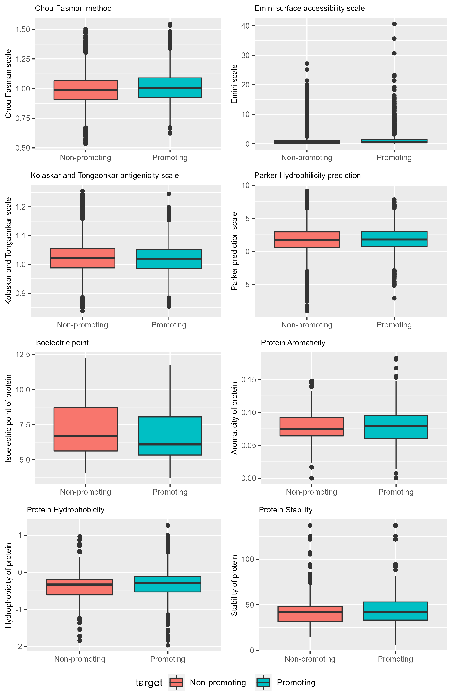
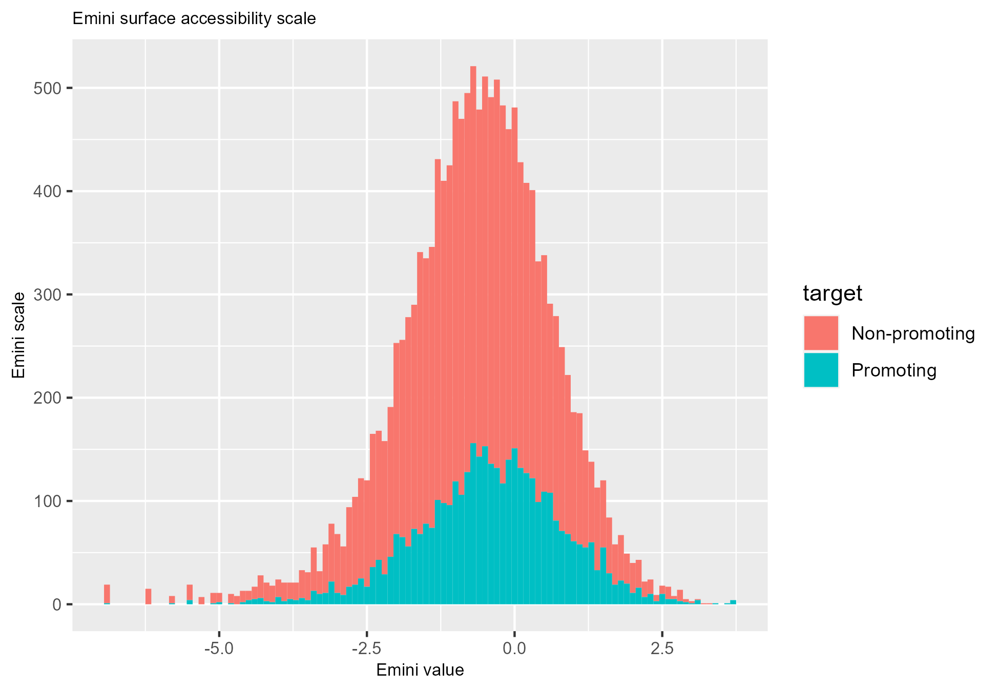
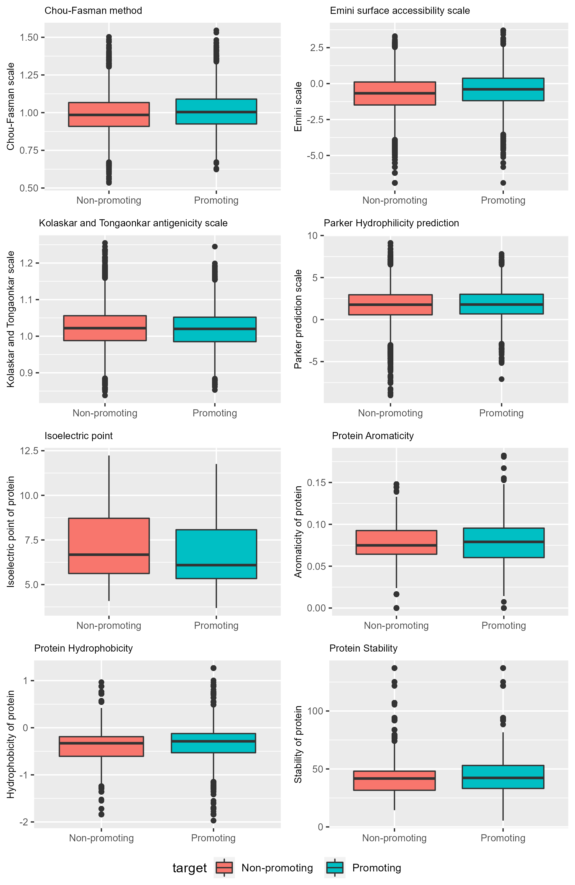

```{r setup, include=FALSE}
knitr::opts_chunk$set(echo=TRUE)
knitr::opts_chunk$set(warning=FALSE)
knitr::opts_chunk$set(fig.align="center")
library(RWeka)
library(pander)
```

```{r load_data, include = FALSE}
bcel_sars_report <- read.arff("../Data/bcel_sars_data.arff")
```
\newpage
# Introduction
xx


\newpage
# Methods
xx


\newpage
# Results
Looking at the imported data, we can see that there are 8 different protein/peptide properties, these were explored further and shown below.
```{r header_of_protein_properties}
pander(head(bcel_sars_report[,6:14]), caption = "Header of the peptide/protein properties")
```
As we can see in the table, the first 4 columns; Chou_fasman, emini, kolaskar_tongaonkar & parker are all peptide properties.
Where as the last 4 columns; isoelectric_point, aromaticity, hydrophobicity & stability are all protein properties.

The protein properties are from the full protein the peptide sequence is derived from.

As such a boxplot has been made to showcase the properties of the peptide/protein properties, these have been grouped by the fact that they promote or don't promote(non-promoting) antigen binding sites.

\newpage

As we can see in the figure, the boxplot for the emini data is unreadable and the data for that plot has been explored further.
In the end it was necessary to perform a log transformation on the data as simply removing the outliers in the plot caused a loss of usable data. The plot of the histogram for the log transformed data is below as follows.



\newpage
As we can see in the histogram data of the log transformed Emini data, we can see that it's now more normally distributed than in the boxplot. As such we can confirm that the log transformation of the Emini data is a success, to further prove said point all boxplots had been plotted again, but with the Emini data being the log transformed data, see the image below.



\newpage
As we can see in the new boxplots is that the Emini data is now normally distributed, albeit with outliers lower and higher still. This further proves the point that the Emini data needs to be log-transformed to be usable further on in the machine learning process.

To continue to prepare for the machine learning process it would be wise to see what the relation of the peptide/protein properties are in regard to each other. For that a correlation matrix was calculated and plotted into a heatmap which follows bellow.


\newpage
As we can see from the plotted correlation matrix heatmap, some aspects of the data are indeed related to each other, while some other aspects, surprisingly aren't. This might be due to the different scales and ranges that are being used for each of the properties.

Now that we've looked at the correlations between the properties, it's time to perform a Principal Component Analysis to visualize the variation in the dataset, we'll further see the correlation between the properties as well if done so.


As we can see from the PCA is that some variables are closely interlinked, forming 4 different groups. These being:
1. Chour_fasman, Parker & Emini
2. Aromaticity, hydrophobicity
3. stability, isoelectric_point
4. Kolaskar_tongaonkar

And further we can see that there aren't really any clear differences between promoting and non-promoting peptide sequences, which might prove trouble-some for the machine learning algorythm, the data might need to be cleaned/transformed/standardized more.


\newpage
# Discussion and Conclussion

From the initial EDA exploration, we can see that the data consists of different scales for the peptide sequences. Which is worrying if we wish to compare those.

That was further proven by the correlation heatmap and the PCA plot, some properties are related to each other despite not only belonging to peptides or proteins. As we can see with the groups that have formed in the PCA plot, explained in the results above.

In the end, a quick conclusion is that the data needs to either be cleaned/transformed or standardized.